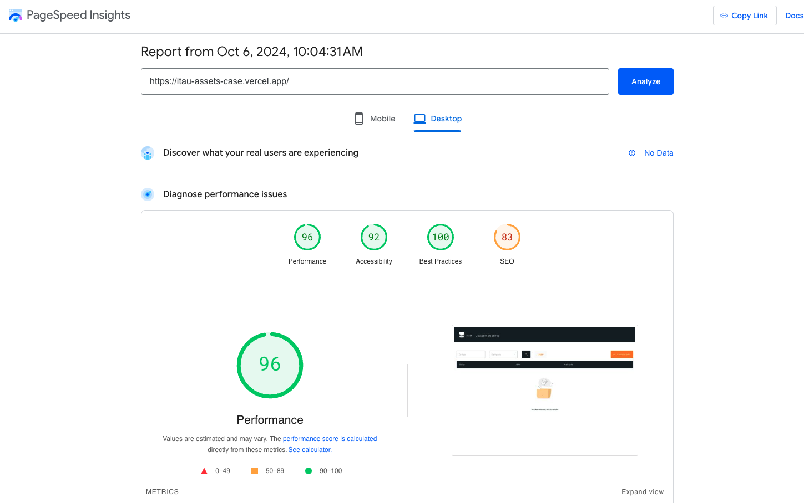
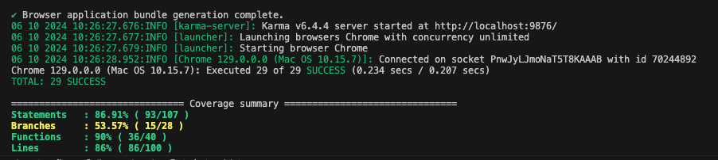

## Itau Assets - Aplicação Angular para Gestão de Produtos

### Descrição

Esta aplicação Angular foi desenvolvida para gerenciar o cadastro e consulta de produtos, atendendo aos requisitos específicos do Itaú Assets. Ela oferece uma interface intuitiva para realizar operações como inclusão, alteração, exclusão e pesquisa de produtos.


#### Solução adotada

A escolha do Angular como tecnologia para este projeto foi motivada pela necessidade de atender aos requisitos do case de forma eficiente. Optei pela versão mais recente para aproveitar as últimas melhorias e correções, garantindo um código mais robusto e atualizado.

Para organizar o projeto, utilizei o ng generate component para criar módulos e componentes de forma estruturada, seguindo uma abordagem orientada a features. Essa estratégia facilita a manutenção e a escalabilidade da aplicação.

Com o objetivo de agilizar o desenvolvimento e garantir uma interface de usuário consistente e acessível, adotei o [Angular Material UI](https://material.angular.io/). Essa biblioteca, recomendada pela própria documentação do Angular, oferece uma ampla gama de componentes pré-construídos e personalizáveis, além de estar alinhada com as diretrizes do [Material Design](https://m3.material.io/).

Para manter o projeto enxuto e evitar a introdução de dependências desnecessárias, utilizei os recursos nativos do Angular para gerenciamento de rotas, estados e armazenamento de dados. Além disso, adotei o Jasmine para a criação de testes unitários, aproveitando a geração automática de arquivos de teste pelo Angular CLI.


### Tecnologias Utilizadas

* **Angular:** [Framework front-end](https://angular.dev/installation) para desenvolvimento web. Versão: 18.2

* **Node.js:** Ambiente de execução JavaScript  Versão: 18.19


### Pré-requisitos

* **Node.js e npm (ou yarn) instalados:**
  * Baixe e instale a versão correta do Node.js para o seu sistema operacional em [https://nodejs.org/en/download/package-manager](https://nodejs.org/en/download/package-manager).

* **Angular CLI:**
  * Instale globalmente o [Angular CLI](https://angular.dev/installation) utilizando o comando `npm install -g @angular/cli`.

### Como rodar a aplicação

1.**Instalar as dependências da aplicação:**

   ```bash
   npm i
   ```

2.**Execute o projeto localmente:**

  ```bash
   npm run start
   ```

3.**Rodar os testes:**
 
  ```bash
   npm run test
   ```

Obs: Para facilitar o teste das funcionalidades, o projeto foi hospedado na [Vercel](https://itau-assets-case.vercel.app/)  


### Extra

PageSpeed Insights é uma ferramenta gratuita da Google que analisa a velocidade de carregamento de uma página web e fornece recomendações para melhorar o desempenho. Ele avalia a página em dispositivos móveis e desktop, fornecendo insights sobre aspectos como otimização de recursos, renderização, compressão e muito mais. Aqui a aplicação teve uma nota de 96/100.



### Relatório de coverage

